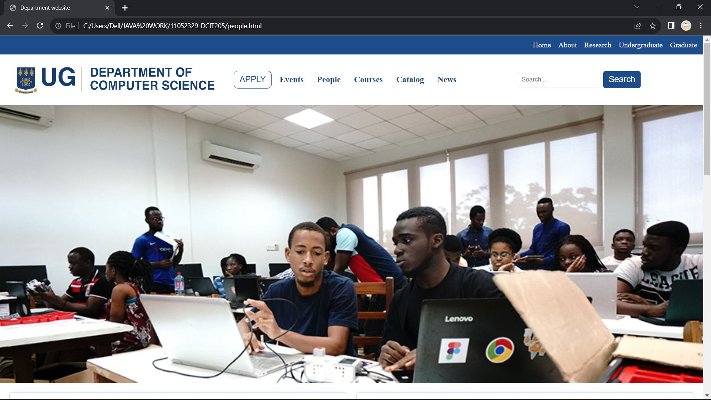

# DCIT_205_IA  STUDENT: 110523329 NAME: NYANYO EDEM LARRY KWAKU
# Computer Science Department Website

Welcome to the Computer Science Department's official website! . This website sertves as an online platform for information about our department, innovation, research,academic program and many more.

## Table of Contents
1. [Introduction](#introduction)
2. [Features](#features)
3. [Pages Overview](#pages-overview)
4. [How to Use](#how-to-use)
5. [Customization](#customization)
6. [Contributing](#contributing)
7. [License](#license)

## Introduction
This website is designed to provide a comprehensive overview of our department, showcase ongiong research , and offer information about our academic programs,events and more.We provide a seamless and engaging experience for our guests.

## Features
- **Responsive Design:** The website is designed to be visually appealing and functional across various devices.
- **Innovative Layout:** Creative layouts and engaging content to captivate visitors.
- **Dynamic Slideshow:** Enjoy a dynamic slideshow on the homepage featuring captivating images.
- **Research Excellence:** Dive into the department's cutting-edge research initiatives.
- **People section:** Learn more about the faculty, staff, and accomplished alumni.
- **Student Showcase:** Explore the achievements and projects of our talented students.
- **Innovation Page:** Discover the latest innovations and advancements in computer science.
- - **Navigation:** Easy navigation theroug the main section - Home,About, Research, Undergraduate, and Graduate.
  - - **Call-to-Action:** Interactive "explore more" page  button to encourage user engagement.

## Pages Overview
1. **Home:** Navigate to the homepage for a quick overview of the department.
2. **About Us:** Learn about the history, vision, and mission of the Computer Science Department.

3. **Catalog:** Get information about admissions, courses, and the application process.
4. **Research:** Explore the department's research excellence and recent publications.
5. **News & Events:** Stay updated with the latest news and upcoming events.
6. **Our Students:** Discover the accomplishments and projects of our talented students.
8. **Courses:** Explore the amazing courses offered at our department.
9. **People:** Meet the leadership team and key individuals in the department.
10. **Contact:** Find contact information to reach out and connect with us.

## How to Use
1. Clone the repository: `git clone https://github.com/Edemowns/11052329_DCIT205.git`
2. Open the desired HTML file in your preferred web browser.
3. Explore different pages using the navigation menu.

## Customization
Feel free to customize the website to match your department's branding or add additional content. The CSS styles are well-organized, making it easy to modify colors, fonts, and layouts.

## Contributing
Contributions are welcome! If you have improvements or new features to suggest, please open an issue or submit a pull request.

## License
This project is licensed under the [UG License](LICENSE).

## Screenshots

### Homepage

### About

### Research

### Undergraduate

### Graduate

### Events

### People

### Courses

### catalog

### News

Enjoy the experience! 🌐✨
